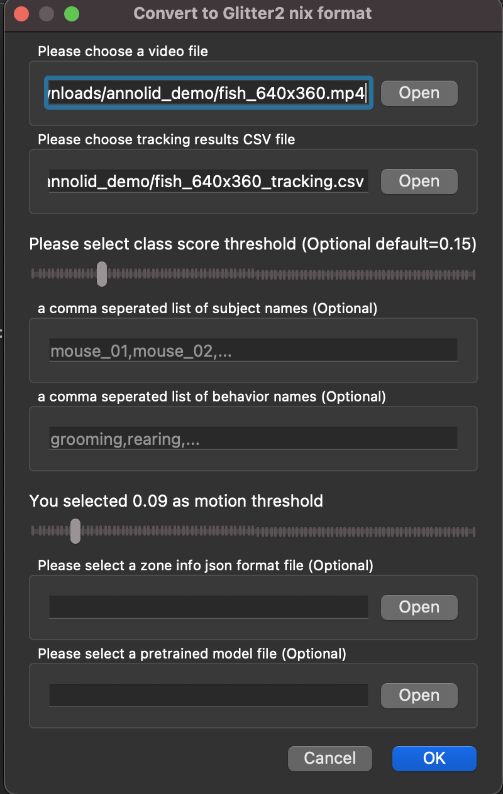

# Freezing and motion assays

## How to Run Dense Motion Estimation

To run dense motion estimation:

1. Open Annolid.
2. Click on the View menu and select Glitter2.
3. In the open dialog, choose a video file and the corresponding tracking CSV file.
4. Select a motion threshold greater than zero, for example, 0.09 as shown in the screenshot below. This motion threshold will be used to decide whether freezing behavior is present or not.



This will generate a CSV file named with the format `video_name_tracking_motion.csv`, for example, `fish_640x360_tracking_motion.csv`. 

Here are the first few rows of the `fish_640x360_tracking_motion.csv` file:

.
Note: The motion index column corresponds to the dense motion estimation method described in the section below.

## Freezing or Not Freezing

By default, Annolid will use the selected motion threshold to produce the freezing binary classification with the "freezing" column based on the motion index. If the motion index is greater and equal than the threshold, it will be classified as "not freezing"; otherwise, it will be classified as "freezing".

Alternatively, you can perform post-processing based on the motion index column to determine a better threshold for classification.


## Methodology for Dense Motion Estimation

In this section, we detail our methodology for dense motion estimation, including the algorithms and techniques utilized. We employ a computer vision method that combines optical flow and instance masks derived from a tracking result CSV file to estimate dense motion across frames in a video. Specifically, the method utilizes the Farneback algorithm [1], implemented in OpenCV [2], to calculate the optical flow between consecutive frames, thereby providing a dense motion field. This optical flow is then employed to compute the motion index, representing the magnitude of motion within each instance mask. The motion index is calculated as the sum of optical flow magnitudes in polar coordinates within the instance mask, normalized by the mask's area. This approach furnishes a quantitative measure of motion within each instance.

Moreover, the method leverages mask Intersection over Union (IOU) to quantify the overlap between instance masks across frames. It further integrates instance tracking results from a CSV file, enabling the analysis of specific instances (e.g., objects) within the video. The output of this method comprises a video annotated with motion flows, along with a tracking CSV file containing motion analysis results, including motion index values for each instance in each frame.

Our dense motion estimation has been validated through comparison with ultrasonic data, showing a high correlation. This validation was conducted in a study by Pranic et al. (2022) [3], where mouse pups' production of ultrasonic vocalizations (USVs) in response to isolation from the nest was examined.

```
[1]: @inproceedings{farneback2003two,
  title={Two-frame motion estimation based on polynomial expansion},
  author={Farneb{\"a}ck, Gunnar},
  booktitle={Image Analysis: 13th Scandinavian Conference, SCIA 2003 Halmstad, Sweden, June 29--July 2, 2003 Proceedings 13},
  pages={363--370},
  year={2003},
  organization={Springer}
}

[2]: @article{bradski2000opencv,
  title={The opencv library.},
  author={Bradski, Gary},
  journal={Dr. Dobb's Journal: Software Tools for the Professional Programmer},
  volume={25},
  number={11},
  pages={120--123},
  year={2000},
  publisher={Miller Freeman Inc.}
}

[3]: @article{pranic2022rates,
  title={Rates of ultrasonic vocalizations are more strongly related than acoustic features to non-vocal behaviors in mouse pups},
  author={Pranic, Nicole M and Kornbrek, Caroline and Yang, Chen and Cleland, Thomas A and Tschida, Katherine A},
  journal={Frontiers in Behavioral Neuroscience},
  volume={16},
  pages={1015484},
  year={2022},
  publisher={Frontiers}
}
```